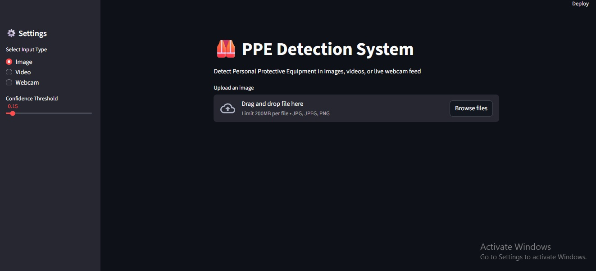
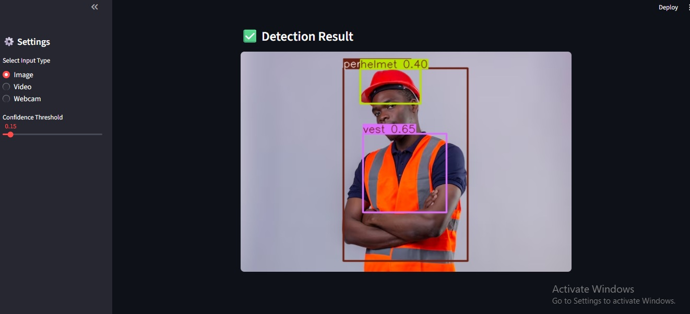
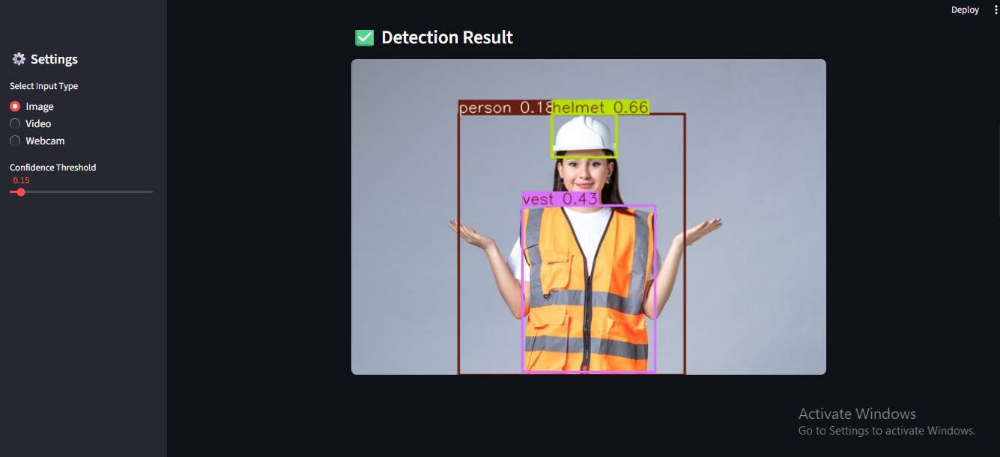

# 🦺 PPE Detection System

A real-time **Computer Vision application** for detecting **Personal Protective Equipment (PPE)** using **YOLOv8** and **Streamlit**.  
The system supports **image upload, video upload, and live webcam streaming** with an interactive and user-friendly interface.

This project aims to enhance **workplace safety** by automatically identifying whether safety equipment is being worn.

---

## 📌 Features
- ✅ PPE detection using **YOLOv8**
- 🖼️ Image-based detection
- 🎥 Video file detection
- 📹 Live webcam detection
- 🧠 Fast and accurate object detection
- 🖥️ Interactive UI built with **Streamlit**

---

## 🧠 Model Details
- **Model:** YOLOv8  
- **Framework:** Ultralytics YOLO  
- **Task:** Object Detection  
- **Classes:** PPE-related objects (e.g., Helmet, Vest, etc.)

---

## 🖼️ Application Screenshots
### 🔹 Application GUI

### 🔹 Detection Result

### 🔹 Detection Result

